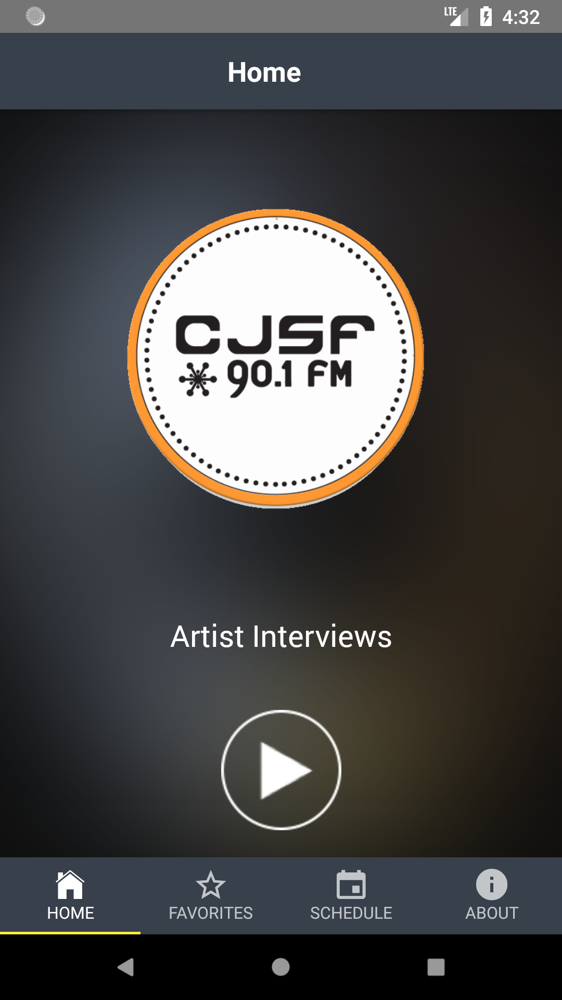
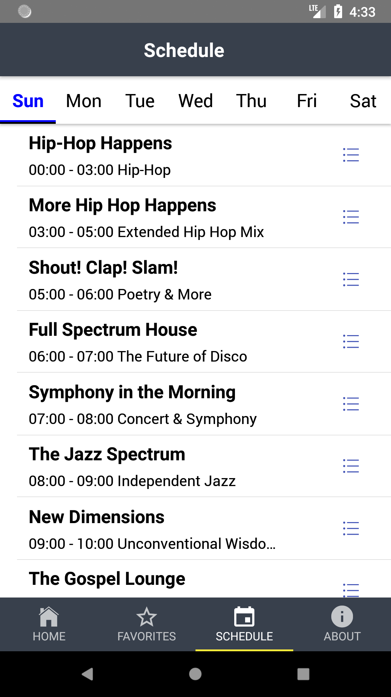
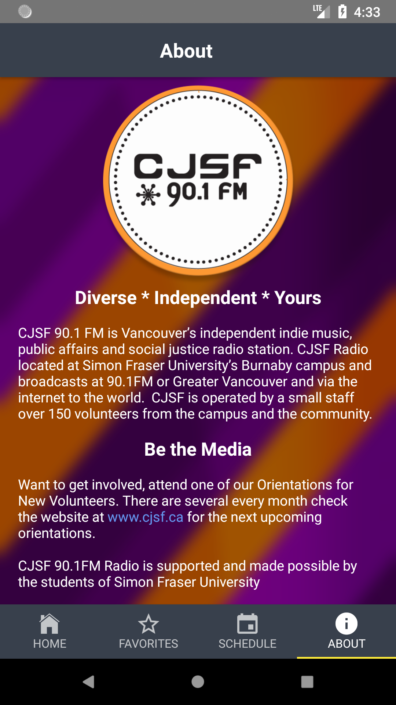
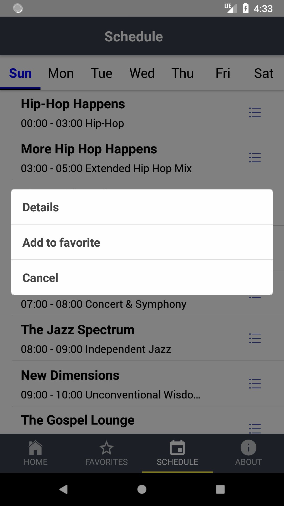
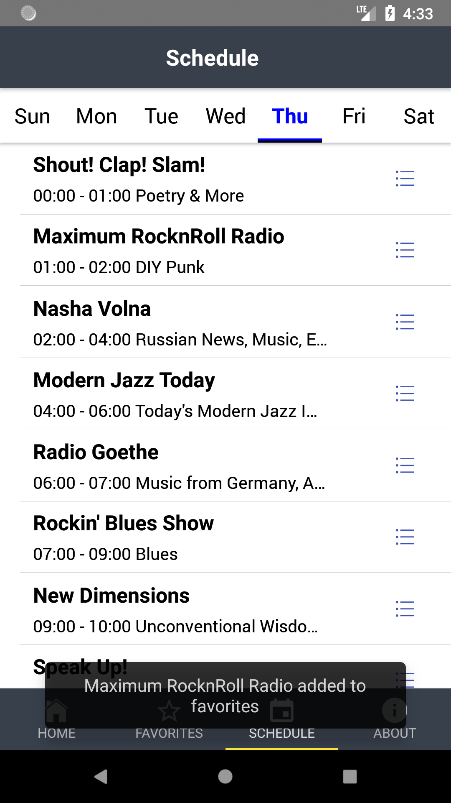
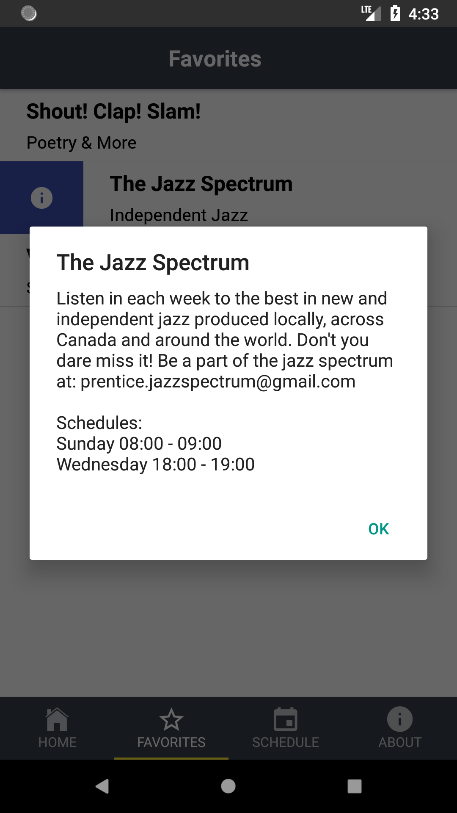
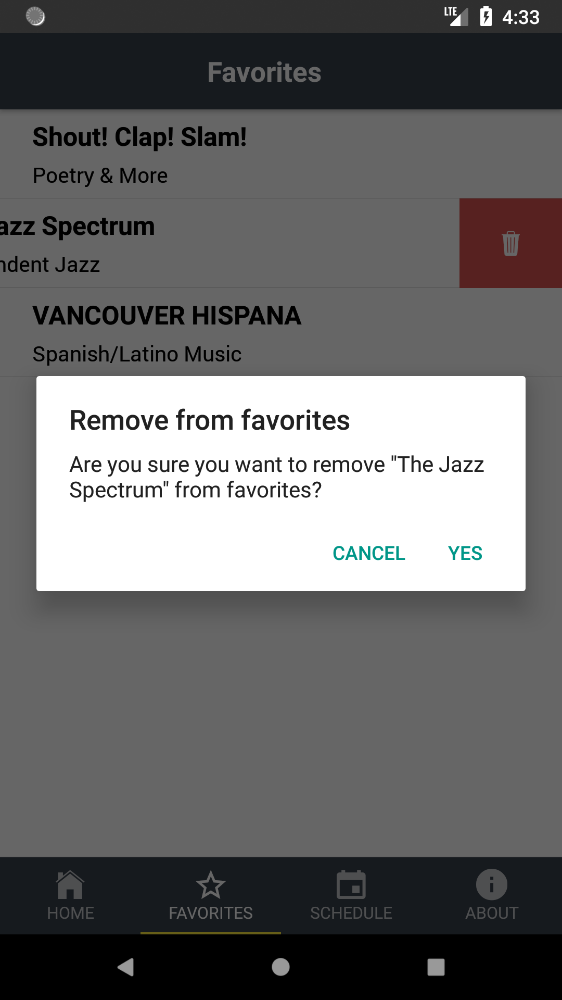
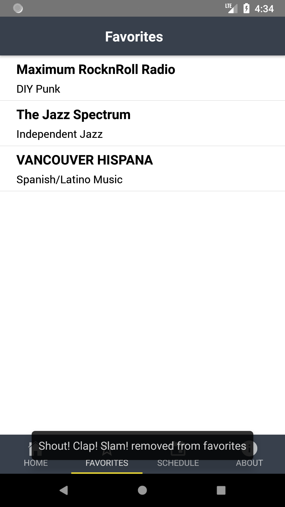

## CJSF Radio App
http://www.cjsf.ca/ 
------

#### How to run:
------
- Install node
- Clone project `git clone https://github.com/Joey-ZhaoyangLi/CJSF-App.git`
- `cd CJSF-App`
- `npm install`
- Open android studio and open emmulator or xcode emmulator 
- run `npm run android`
- You should have server running and you should see apk or project installed on emmulator 

##### Handy shortcuts:
------
- Press <kbd>ctrl</kbd> +<kbd> M </kbd> for Opening emmultor options (Hot reloding, debuging) for android
